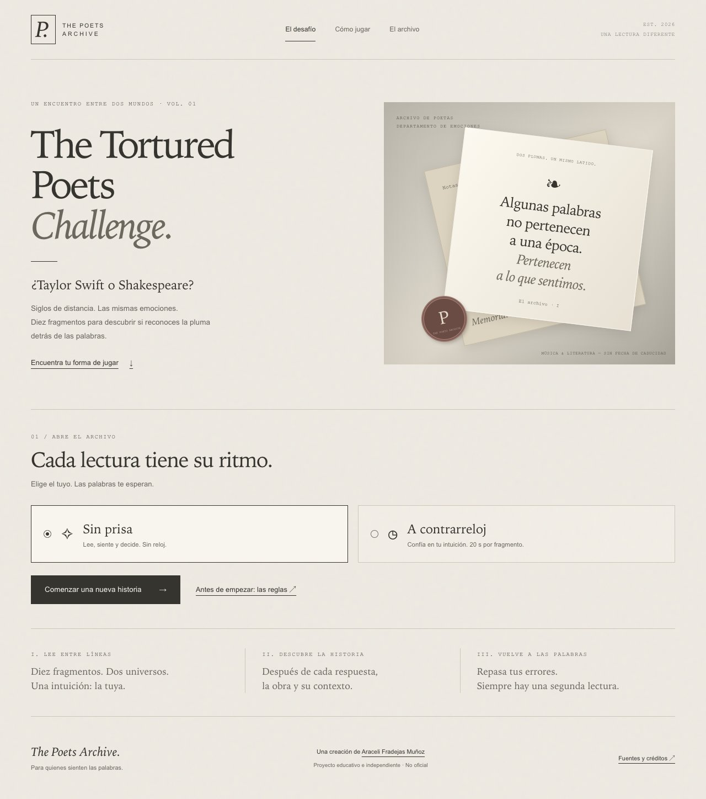
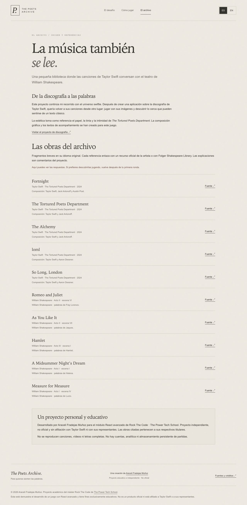
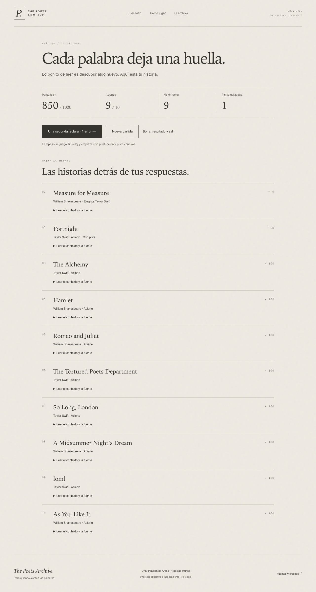
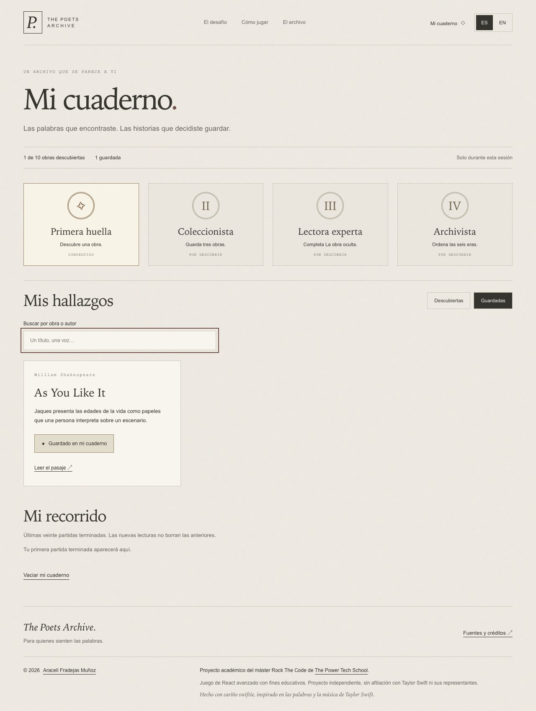
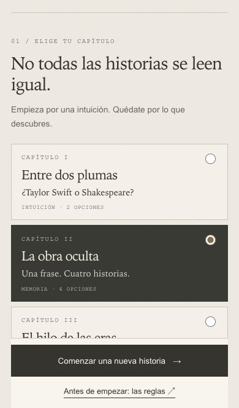
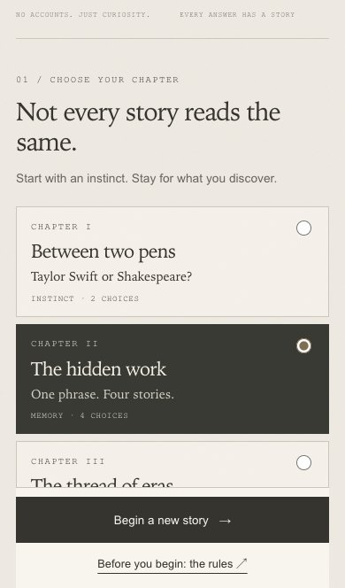
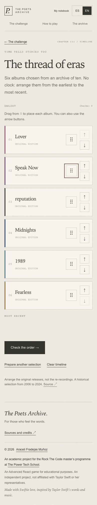
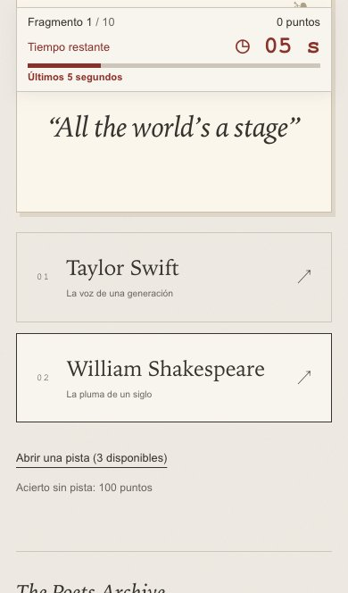
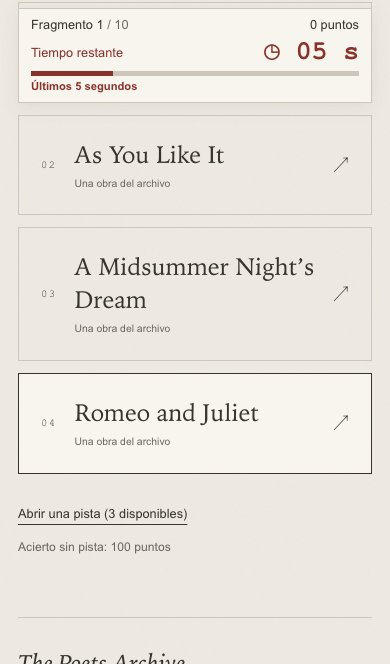
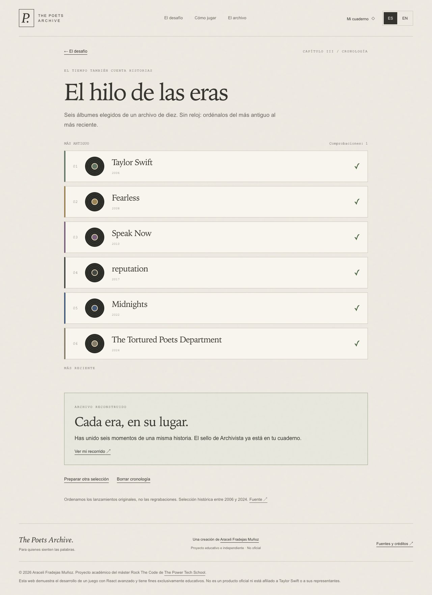

# Memoria técnica · The Poets Archive

## Datos del proyecto

| Dato | Información |
| --- | --- |
| Proyecto | The Poets Archive · The Tortured Poets Challenge |
| Entrega | Proyecto 12 · React avanzado |
| Módulo | 7 · Frontend con React |
| Formación | Máster Rock The Code · The Power Tech School |
| Autora | Araceli Fradejas Muñoz |
| Tecnologías principales | React, React Router, JavaScript, Vite, CSS y dnd-kit |
| Web en castellano | [The Poets Archive](https://the-poets-archive.vercel.app) |
| Web en inglés británico | [The Poets Archive · EN](https://the-poets-archive.vercel.app/en) |
| Repositorio público | [RTC-PROYECTO12-REACT-AVANZADO](https://github.com/AraceliFradejas/RTC-PROYECTO12-REACT-AVANZADO) |
| Código de la aplicación | [src](src) |
| Revisión documentada | 27 de septiembre de 2026 |

> Esta memoria recoge la organización del juego, las decisiones sobre estado y renderizados y las pruebas realizadas. La galería acompaña las explicaciones con capturas de escritorio y móvil.

## Contenido

- [1. Contexto y motivación](#1-contexto-y-motivación)
- [2. Objetivos](#2-objetivos)
- [3. Requisitos y cumplimiento](#3-requisitos-y-cumplimiento)
- [4. Tecnologías](#4-tecnologías)
- [5. Arquitectura](#5-arquitectura)
- [6. Flujo de la aplicación](#6-flujo-de-la-aplicación)
- [7. Datos y fuentes](#7-datos-y-fuentes)
- [8. Estados límite y accesibilidad](#8-estados-límite-y-accesibilidad)
- [9. Pruebas](#9-pruebas)
- [10. Resultados](#10-resultados)
- [11. Evolución del desarrollo](#11-evolución-del-desarrollo)
- [12. Evidencias](#12-evidencias)
- [13. Dificultades y decisiones](#13-dificultades-y-decisiones)
- [14. Aprendizajes del proyecto](#14-aprendizajes-del-proyecto)
- [15. Posibles mejoras](#15-posibles-mejoras)
- [16. Publicación, SEO y acceso para asistentes](#16-publicación-seo-y-acceso-para-asistentes)
- [17. Fuentes y autoría](#17-fuentes-y-autoría)

## 1. Contexto y motivación

Al pensar en qué juego podía hacer para esta entrega, me acordé de los vídeos de TikTok en los que muchos swifties intentan adivinar si una frase es de Taylor Swift o de Shakespeare. De ahí surgió la idea: ¿por qué no tener ese reto en un juego digital?

Después de trabajar con canciones y álbumes de Taylor Swift en el Proyecto 6, esta propuesta me permitía retomar una temática que me gusta y practicar React avanzado. El cruce con Shakespeare parte de ese juego de reconocer las frases; al responder, se descubre la canción o la obra de la que procede cada una.

La idea inicial se amplía con un segundo desafío de títulos y una cronología de álbumes. El cuaderno reúne las obras descubiertas y las partidas terminadas, para que el recorrido tenga continuidad durante la sesión.

**The Poets Archive** es la identidad del archivo y **The Tortured Poets Challenge** el nombre del juego. La inspiración visual de *The Tortured Poets Department* aparece en el papel, la tinta, los tonos marfil y la composición editorial. El proyecto mantiene una identidad propia y explica su carácter académico, independiente y no oficial.

## 2. Objetivos

El objetivo principal es aplicar hooks, reducers y control de renderizados a una experiencia que permita:

- elegir entre tres desafíos y dos modos para las preguntas;
- reconocer una voz o un título a partir de diez fragmentos;
- utilizar pistas, obtener puntos y repasar los errores;
- ordenar seis álbumes con arrastre, botones o teclado;
- consultar fuentes y guardar las obras que llamen la atención;
- mantener la partida al navegar o cambiar de idioma;
- utilizar la interfaz en castellano e inglés británico;
- jugar desde una pantalla estrecha sin perder de vista la acción principal ni el reloj.

El estado se mantiene en React. No se incorporan cuentas, servidor, base de datos ni mecanismos persistentes para guardar partidas. A diferencia de otros proyectos, recargar la página inicia una sesión vacía: es una condición de esta entrega.

## 3. Requisitos y cumplimiento

| Requisito | Cómo se ha implementado | Evidencia o alcance |
| --- | --- | --- |
| Full responsive | Grid, Flex, tamaños fluidos y media queries por sección. | Pruebas de anchura a 320, 768 y 1440; selector también a 390 y 700. Perfiles emulados. |
| CSS y HTML adecuados | Variables, hojas por responsabilidad, landmarks, encabezados, formularios y listas. | Inspección de componentes y comprobaciones automáticas con axe-core. |
| `react-router-dom` | `BrowserRouter`, `Routes`, `Route`, `Link` y `NavLink`. | Siete páginas por idioma y ruta desconocida; accesos directos y navegación comprobados. |
| Custom hook | `useGame`, `useChronology`, `useCountdown` y `useFocus`. | Acciones, preparación de rondas, temporizador y gestión del foco. |
| `useReducer` | Partida, cronología y cuaderno tienen transiciones explícitas. | Pruebas de reglas, reinicio, inserción y operaciones repetidas. |
| Evitar renderizados innecesarios | Segundos locales en Timer, callbacks estables y QuestionCard memorizada. | Tres segundos sin nuevos renderizados de Game ni QuestionCard. |
| Componentes correctos | Páginas que componen piezas de pregunta, respuestas, cuaderno y cronología. | Responsabilidades y props identificadas en la arquitectura. |
| Datos solo en React | Proveedores por encima de las rutas, sin almacenamiento persistente. | Puntuación conservada al navegar y sesión vacía tras recargar. |
| Repositorio público | Código y documentación accesibles en GitHub. | Enlace de repositorio y web publicados. |

Al responder, pedir una pista o mover una era, React actualiza los componentes correspondientes. La optimización del reloj se comprueba por separado en la sección de pruebas.

## 4. Tecnologías

### React, React Router y Vite

React compone la interfaz desde el estado. React Router permite cambiar de pantalla sin reconstruir los proveedores. Vite prepara el desarrollo y la compilación; un script adicional renderiza la aplicación a HTML para las rutas conocidas.

El proyecto utiliza React 19, React Router 7 y Vite 7. Requiere Node.js 22.12 o posterior. Las versiones exactas quedan registradas en [package-lock.json](package-lock.json).

### CSS y recursos visuales

Los estilos se distribuyen por responsabilidad: portada, estructura, preguntas, contador, cuaderno, cronología y footer. Se utilizan tipografías del sistema, CSS para discos y sellos y un favicon SVG. La escena de portada es una recreación generada con IA, optimizada a JPEG de unos 288 KB. Su procedencia está en [Recursos](docs/RECURSOS.md).

### Arrastre y formularios

`@dnd-kit/core`, `@dnd-kit/sortable` y `@dnd-kit/utilities` resuelven sensores, ordenación visual y transformación de tarjetas. El cambio definitivo de orden sigue perteneciendo al reducer de la cronología.

React Hook Form se ha consultado como recurso, pero no se instala. El formulario de entrada elige capítulo y modo con radios nativos y `useState`; no necesita gestionar campos complejos o validaciones adicionales.

### Pruebas y publicación

Vitest comprueba reglas y catálogos. Playwright recorre la aplicación en navegador y axe-core detecta incidencias automáticas de accesibilidad. Vercel publica la compilación desde la rama `main` de GitHub.

## 5. Arquitectura

```text
src/
  components/
    home/         Portada y selectores
    notebook/     Hallazgos, historial y confirmación de vaciado
    chronology/   Lista ordenable y tarjeta de era
    ...           Layout, pregunta, respuestas, reloj y revelación
  context/        Partida, cronología, cuaderno e idioma
  data/           Preguntas, obras, enlaces y álbumes
  game/           Reducers, mezcla, reglas y duración de preguntas
  hooks/          Acciones de los juegos, cuenta atrás y foco
  i18n/           Traducciones y rutas ES/EN
  pages/          Pantallas de la aplicación
  seo/            Metadatos y renderizado a HTML
  styles/         Estilos por responsabilidad
scripts/          Prerenderizado y medición de renderizados
tests/            Pruebas unitarias y recorridos de navegador
docs/             Evidencias, recursos y configuración del despliegue
```

### Estado compartido y estado local

Los proveedores se encuentran por encima de las rutas en [App.jsx](src/App.jsx). Navegar no destruye la partida. La separación evita que cada página guarde su propia copia de los puntos o de los álbumes.

| Estado | Dónde vive | Función |
| --- | --- | --- |
| Fase, preguntas, respuestas, puntos, pistas, racha y plazo | `GameProvider` / `gameReducer` | Una partida de preguntas coherente. |
| Selección de álbumes, orden, comprobaciones y ronda | `ChronologyProvider` / `chronologyReducer` | El desafío de eras. |
| Descubrimientos, favoritos e historial | `NotebookProvider` | El cuaderno de la sesión. |
| Idioma | URL y `LanguageProvider` | Traducciones y enlaces equivalentes. |
| Capítulo y modo elegidos | `Home` | Configuración antes de comenzar. |
| Segundos restantes | `Timer`, mediante `useCountdown` | Actualizar solo la cuenta atrás. |
| Tarjeta cogida | `EraList` | Representación temporal del gesto de arrastre. |
| Búsqueda, filtro y confirmación de vaciado | Componentes del cuaderno | Interacciones de esa pantalla. |

Estado y dispatch se exponen por contextos separados cuando procede. Los resultados derivados no se almacenan como copias independientes: los sellos y la lista filtrada parten de los datos de sesión.

### Hooks y componentes

| Pieza | Responsabilidad |
| --- | --- |
| [useGame](src/hooks/useGame.js) | Expone iniciar, responder, pedir pista, avanzar y reiniciar mediante callbacks. |
| [useChronology](src/hooks/useChronology.js) | Prepara seis álbumes y evita iniciar con una selección ya ordenada. |
| [useCountdown](src/hooks/useCountdown.js) | Calcula segundos desde la fecha límite y limpia intervalo y listener. |
| [useFocus](src/hooks/useFocus.js) | Sitúa el foco en el contenido de la pregunta o revelación. |
| [QuestionCard](src/components/QuestionCard.jsx) | Presenta fragmento, número y pista; utiliza `memo`. |
| [Timer](src/components/Timer.jsx) | Número, barra y aviso del tiempo restante. |
| [EraList](src/components/chronology/EraList.jsx) y [EraCard](src/components/chronology/EraCard.jsx) | Separan la interacción de arrastre de la tarjeta y sus controles. |
| [WorkLinks](src/components/WorkLinks.jsx) | Comparte los enlaces de las obras entre pantallas. |

La lista de hallazgos utiliza `useMemo` a partir de descubrimientos, favoritos, filtro y búsqueda. No se memoriza cada cálculo pequeño por sistema; contar diez respuestas no justifica añadir complejidad.

### Reducers y reglas compartidas

`gameReducer` recibe las preguntas mezcladas y la hora como datos de las acciones. No genera fechas ni números aleatorios. `buildRound` construye los capítulos de voces y obras; `shuffle` mezcla una copia mediante Fisher–Yates.

`isChronologicalOrder` comparte la regla de ordenación entre la preparación y la comprobación de eras. `QUESTION_DURATION_MS` comparte los veinte segundos entre el reducer y la barra del reloj. Las reglas reutilizadas tienen una única definición.

## 6. Flujo de la aplicación

```text
Portada → capítulo
  ├─ Voces u obras → modo → pregunta → respuesta o tiempo agotado
  │                                      ↓
  │                                  revelación
  │                                      ↓
  │                            siguiente / resultados
  │                                      ↓
  │                             repaso / nueva partida
  └─ Eras → ordenar → comprobar → ajustar o completar

Durante la sesión → archivo, fuentes y cuaderno
```

### Preguntas y puntuación

La partida tiene cuatro fases: `idle`, `question`, `reveal` y `finished`. Solo la fase de pregunta admite una respuesta o pista. Solo la revelación permite avanzar. Una segunda respuesta no vuelve a puntuar; una acción de otra pregunta se ignora.

Un acierto sin pista suma 100 puntos; con pista suma 50. Un error o vencimiento suma cero. Hay tres pistas por ronda y una como máximo por pregunta. La racha crece con los aciertos y se reinicia al fallar, conservando la mejor.

El capítulo de obras ofrece cuatro títulos diferentes de la misma procedencia, con una única opción correcta. El repaso mantiene el capítulo, utiliza únicamente las preguntas falladas y comienza una nueva ronda sin reloj.

### Contrarreloj

El reducer guarda una fecha límite. `useCountdown` consulta el tiempo real en lugar de restar uno sin referencia al reloj. Si la pestaña queda en segundo plano o se visita otra pantalla, el plazo no se reinicia. Una respuesta recibida después del límite se trata como tiempo agotado.

El panel permanece visible al bajar hasta las opciones. Muestra segundos grandes, una barra proporcional y un aviso textual en los últimos cinco segundos. No anuncia cada segundo a un lector de pantalla. Al responder se desmonta; la siguiente pregunta inicia un plazo nuevo.

### Cronología y arrastre

La cronología utiliza las fases `idle`, `ordering` y `finished`. Mover con botones o arrastrar modifica el orden, pero no suma comprobaciones. `CHECK` cuenta un intento y determina si todos los álbumes están colocados.

El tirador activa el arrastre tras seis píxeles de movimiento. Solo ese control utiliza `touch-action: none`; el resto de la tarjeta permite desplazar la página. Una capa flotante acompaña el gesto. Al soltar se envía `REORDER` con el álbum y el destino; el reducer inserta la pieza sin perder las demás. Escape cancela sin modificar el orden.

Los controles desaparecen al terminar y se revelan los años. Se puede preparar otra selección o borrar la cronología desde la interfaz.

### Cuaderno y duración de la sesión

El cuaderno conserva obras descubiertas, favoritos y hasta veinte partidas terminadas. Permite buscar por obra o autor, filtrar guardadas y vaciar con confirmación. Registrar una partida o descubrir una obra dos veces no duplica los datos.

Los puntos y la pregunta se conservan al visitar instrucciones, archivo o cuaderno y regresar por «Volver a ella». El cambio de idioma conserva también las pistas y el plazo. Abandonar la partida reinicia su marcador; comenzar otra la sustituye. Los resultados anteriores del cuaderno permanecen hasta vaciarlo o recargar.

Recargar o cerrar la página elimina la sesión. No hay `localStorage`, `sessionStorage`, cookies de juego, caché persistente ni base de datos. El idioma se deduce de la URL y no necesita guardarse aparte.

### Rutas

| Castellano | Inglés británico | Finalidad |
| --- | --- | --- |
| `/` | `/en` | Selección y acceso a partidas de la sesión. |
| `/instrucciones` | `/en/how-to-play` | Reglas y controles. |
| `/archivo` | `/en/archive` | Obras, referencias y créditos. |
| `/partida` | `/en/game` | Pregunta y revelación. |
| `/resultados` | `/en/results` | Resumen y repaso. |
| `/cuaderno` | `/en/notebook` | Hallazgos e historial. |
| `/cronologia` | `/en/timeline` | Ordenación de álbumes. |
| Cualquier otra dirección | Cualquier otra dirección | Página no encontrada. |

## 7. Datos y fuentes

### Catálogo de preguntas

El catálogo contiene cinco canciones y cinco obras de Shakespeare. No se importa una semilla completa del Proyecto 6 ni se añaden preguntas repetidas para aumentar volumen.

| Información | Uso |
| --- | --- |
| Identificador estable | Relacionar pregunta, respuesta, favorito y repaso. |
| Fragmento y procedencia | Presentar la cita y comprobar su autoría. |
| Obra y colección | Revelar el título y construir alternativas. |
| Pista y explicación | Acompañar la lectura antes y después de responder. |
| Créditos | Reconocer composición y atribución del pasaje. |
| Fuentes y enlaces | Continuar hasta la obra de referencia. |

«Taylor Swift» identifica una canción de su repertorio; los créditos reconocen también a sus colaboradores. Los fragmentos conservan el inglés original y se identifican con `lang="en"`.

### Enlaces musicales y literarios

Cada canción enlaza con su vídeo oficial y con pistas concretas de Apple Music y Spotify. El catálogo pequeño permite seleccionar destinos directos en lugar de búsquedas por título. No se incrustan reproductores ni se exige una cuenta para jugar.

Los pasajes de Shakespeare enlazan con Folger Shakespeare Library, incluyendo el identificador de línea de su edición. Se ha comprobado la correspondencia entre cita y destino. La disponibilidad musical puede depender de región o cuenta; no se presenta la revisión de enlaces como una prueba de reproducción de servicios de pago.

JetPunk y TriviaCreator son referencias de la mecánica. La atribución de los fragmentos se apoya en las fuentes individuales, recogidas en [ENLACES.md](docs/ENLACES.md).

### Álbumes y recursos visuales

Las eras utilizan diez álbumes originales entre 2006 y 2024. Es una selección histórica, no una promesa de discografía completa o actualizada automáticamente. Se utilizan sus fechas originales, sin mezclar regrabaciones.

La imagen de portada es una recreación editorial generada para el proyecto, no una fotografía real ni una imagen oficial. Los discos y sellos son CSS y no reproducen portadas. Las capturas de documentación no forman parte de los recursos que carga el juego. [Procedencia y preparación](docs/RECURSOS.md).

## 8. Estados límite y accesibilidad

| Situación | Comportamiento |
| --- | --- |
| Abrir partida o resultados sin sesión | Mensaje de estado vacío y enlace para comenzar. |
| Responder dos veces | El reducer solo admite la primera respuesta válida. |
| Usar una pista ya utilizada o sin pistas disponibles | El control y la transición impiden repetirla. |
| Responder cuando vence el plazo | Se registra tiempo agotado. |
| Mover una era fuera de la lista o después de terminar | El reducer no modifica el estado. |
| Repetir un registro de partida | El cuaderno evita duplicados por identificador. |
| Búsqueda sin coincidencias | Se presenta el estado vacío del cuaderno. |
| Ruta inexistente | Página de error con salida de navegación. |

Se utilizan `header`, `nav`, `main`, `footer`, listas, `fieldset`, `legend`, radios, botones y enlaces. Hay foco visible, salto al contenido y foco en pregunta y revelación. El modo sin prisa evita imponer un límite temporal a toda la experiencia.

El arrastre tiene instrucciones y anuncios ES/EN; los botones permiten ordenar sin realizar el gesto. El aviso de tiempo combina texto y color. Las transiciones respetan `prefers-reduced-motion`.

La revisión automática no sustituye una auditoría completa con lector de pantalla. El cambio de idioma traduce interfaz, pistas, explicaciones, controles y footer; las obras conservan sus títulos originales.

## 9. Pruebas

### Comandos reproducibles

```bash
npm ci
npm run lint
npm test
SITE_URL=https://the-poets-archive.vercel.app npm run build
npm run test:e2e
npm run check:renders
```

En equipos sin Chrome en la ubicación configurada de macOS, se instala Chromium con `npx playwright install chromium`. Para probar producción se utiliza `PLAYWRIGHT_BASE_URL=https://the-poets-archive.vercel.app npm run test:e2e`.

### Ejecuciones y alcance

Las comprobaciones se han realizado durante las revisiones de cada función. No se suman como si todas pertenecieran a una única ejecución final.

| Comprobación | Resultado documentado |
| --- | --- |
| Lint y compilación | Correctos tras las últimas modificaciones funcionales. |
| Vitest | 18 pruebas correctas de reglas, catálogos y traducciones. |
| Suite inicial en producción | 28 recorridos correctos en escritorio y perfil móvil. |
| Ajuste del selector | Suite local de 30 recorridos; prueba específica repetida en producción. |
| Arrastre de eras | Seis recorridos existentes de capítulos y dos nuevos de arrastre correctos en local; los dos de arrastre también en producción. |
| Panel contrarreloj | Veinte recorridos existentes de juego e idiomas y cuatro pruebas nuevas correctos en local; las cuatro nuevas también en producción. |
| Puntuación de sesión | Dos recorridos contra producción: navegación, cambio de idioma y recarga. |
| axe-core | Sin infracciones detectadas en las pantallas y estados incluidos en los recorridos documentados. |
| Safari de macOS | Portada, cambio de idioma, respuesta, favorito, cuaderno y recarga en un recorrido manual anterior al arrastre y al nuevo contador. |

Las pruebas móviles utilizan Chromium con perfil de iPhone 13: pantalla de 390 × 844 y viewport de 390 × 664 píxeles CSS. Se añaden otras anchuras para comprobar desbordamientos. Los eventos táctiles se emulan; no acreditan el comportamiento del gesto en un teléfono físico.

### Medición de renderizados

La comprobación principal consiste en aislar los segundos dentro de `Timer`: `Game` recibe el plazo, pero no el valor que cambia cada segundo.

Como comprobación adicional, `scripts/check-renders.mjs` utiliza una sonda experimental de React DevTools en desarrollo. Cuenta trabajo confirmado al avanzar tres segundos. Depende de detalles internos de React y puede necesitar ajustes al actualizarlo; no se utiliza en la aplicación publicada.

| Componente | Antes | Después |
| --- | ---: | ---: |
| Game | 1 | 1 |
| QuestionCard | 1 | 1 |
| Timer | 1 | 4 |

Se conserva StrictMode. Esta medición verifica el aislamiento del temporizador, no todas las interacciones posibles. Los detalles y límites están en [VALIDACION.md](docs/VALIDACION.md).

## 10. Resultados

La aplicación publicada permite completar los tres capítulos, revisar respuestas, consultar fuentes y reunir hallazgos durante la sesión. Los idiomas tienen rutas equivalentes y el cambio entre ellos conserva el estado.

La revisión móvil ha dado lugar a dos ajustes concretos: tarjetas de selección más compactas, con el botón de comenzar visible dentro del selector, y un contador que permanece a la vista mientras se llega a las respuestas. La cronología permite arrastrar sin eliminar la alternativa de botones.

La puntuación se conserva al navegar dentro de la aplicación. Recargar la elimina por diseño; no se ha añadido persistencia para modificar esa condición de la entrega.

## 11. Evolución del desarrollo

| Revisión | Resultado incorporado |
| --- | --- |
| Juego de voces | Diez fragmentos, pistas, dos modos y repaso. |
| Ampliación temática | Capítulo de obras, cronología y cuaderno. |
| Interfaz bilingüe | ES/EN, rutas equivalentes, textos y metadatos localizados. |
| Fuentes | Enlaces directos a pistas y pasajes; componente compartido. |
| Organización | Helpers comunes y separación de componentes del cuaderno. |
| Publicación | Vercel y dominio `the-poets-archive.vercel.app`. |
| Selector móvil | Tarjetas compactas y acción de comenzar visible. |
| Cronología | Arrastre táctil, ratón, teclado y cancelación. |
| Contrarreloj | Panel visible, barra y aviso final. |
| Estado de sesión | Revisión de puntuación al navegar y de reinicio al recargar. |

La documentación describe el resultado actual de estas revisiones. Las ampliaciones se explican en sus secciones correspondientes, en lugar de mantener instrucciones antiguas y añadir correcciones al final.

## 12. Evidencias

Las siguientes capturas corresponden a la aplicación compilada y se conservan en `docs/screenshots`. Las imágenes actuales proceden de ejecuciones locales de las pruebas; varias funciones se verificaron además contra producción. Una captura muestra un estado visual, mientras que la prueba funcional acredita la interacción descrita.

La revisión es del **27/09/2026**. Escritorio: perfil de **1280 × 720**. Móvil: viewport de **390 × 664**. Las capturas completas tienen mayor altura porque incluyen el contenido desplazable.

### 12.1. Portada en escritorio

La portada presenta la identidad del archivo, los accesos a los desafíos y el cuaderno. Los capítulos se eligen antes del modo. Esta imagen permite revisar la composición editorial y su continuidad hasta el footer.



### 12.2. Archivo y fuentes

El archivo reúne las diez obras, explicaciones y destinos de referencia. La comprobación sin JavaScript confirma que ese contenido llega en el HTML; la imagen, por sí sola, no demostraría ese comportamiento.



### 12.3. Resultados

La pantalla reúne puntuación, aciertos, mejor racha y pistas. Las pruebas completan una ronda y verifican el repaso con las preguntas falladas, sin duplicar respuestas ni reutilizar puntos de la ronda anterior.



### 12.4. Cuaderno de la sesión

Los hallazgos, favoritos, sellos e historial se presentan en la misma página. La prueba busca una obra, aplica el filtro de guardadas y vacía con confirmación. El registro de una partida no se duplica al volver a consultar sus resultados.



### 12.5. Selección de capítulo en iPhone 13 emulado

Las tarjetas móviles conservan título, resumen y tipo de desafío. El detalle ampliado permanece disponible para lectores de pantalla. El botón de comenzar queda visible dentro del selector. La prueba comprueba su posición al elegir cualquiera de los tres capítulos, también en inglés.

<a href="docs/screenshots/selector-iphone13-es.jpg"></a>

<a href="docs/screenshots/selector-iphone13-en.jpg"></a>

### 12.6. Arrastre de eras

La captura muestra el tirador y la alternativa de flechas. El recorrido automático mueve una tarjeta varias posiciones, conserva el orden al cambiar de idioma, cancela con Escape y realiza un movimiento con teclado. La imagen corresponde a un estado después de la interacción, no a una grabación del gesto.

<a href="docs/screenshots/arrastre-eras-mobile.jpg"></a>

[Versión de escritorio](docs/screenshots/arrastre-eras-desktop.jpg).

### 12.7. Contador visible durante las respuestas

Estas capturas están tomadas después de bajar hasta las opciones. El panel permanece en la parte superior, con cinco segundos y el aviso final. La prueba verifica ambos capítulos, cambia a inglés sin reiniciar el plazo y comprueba respuesta, siguiente pregunta y vencimiento.

<a href="docs/screenshots/reloj-voices-mobile.jpg"></a>

<a href="docs/screenshots/reloj-works-mobile.jpg"></a>

### 12.8. Cronología completada

Al acertar se revelan las fechas y se muestra la finalización. La prueba comprueba además el sello de Archivista y el historial del cuaderno. Tras recargar se espera una sesión vacía.



## 13. Dificultades y decisiones

### Separar la partida del reloj

Guardar los segundos en el estado general provocaría actualizaciones del juego cada segundo. Se mantiene la fecha límite en la partida y el valor visible en `Timer`. La medición comprueba el efecto de esa separación.

### Mantener la puntuación sin persistencia

Los proveedores sobreviven a los cambios de ruta. Así se puede consultar una fuente y volver al mismo fragmento. No se necesitan cookies para ese recorrido. Recuperar la sesión tras cerrar el navegador requeriría un alcance distinto del requisito de esta entrega.

### Hacer visible la acción en móvil

Las tarjetas iniciales ocupaban demasiado espacio vertical. Se redujo la decoración y se fijó la acción dentro del selector. El reloj sufría un problema parecido: existía, pero quedaba por encima de la zona visible. Se convirtió en un panel que acompaña el desplazamiento durante la pregunta.

### Arrastrar sin impedir el desplazamiento

Bloquear el gesto táctil en toda la tarjeta dificultaría recorrer una lista larga. El arrastre se inicia desde un control concreto. Los botones y el teclado ofrecen otra manera de ordenar; el reducer conserva la responsabilidad sobre los datos.

### Evitar duplicación y funciones densas

Las correcciones de proyectos anteriores se aplican cuando corresponden. Se comparte `isChronologicalOrder`, se separan hallazgos, historial y vaciado del cuaderno y se centraliza la duración del reloj. El número de aciertos se calcula una vez en resultados y se pasa a `ReaderPortrait`.

## 14. Aprendizajes del proyecto

El proyecto permite relacionar una acción concreta con una transición: responder cambia la fase y los puntos; mover una tarjeta cambia el orden; comprobar una cronología registra un intento. El reducer reúne esas reglas y facilita probar casos que no deben modificar el estado.

También muestra la diferencia entre estado compartido, estado local y datos derivados. Los puntos deben estar disponibles entre rutas; los segundos solo afectan al reloj; una lista filtrada se obtiene a partir de los hallazgos y los filtros existentes.

La optimización se apoya en una medición concreta. Separar el temporizador evita trabajo innecesario sin impedir las actualizaciones que sí cambian lo que ve la persona. `memo`, `useMemo` y `useCallback` responden a necesidades distintas.

La revisión responsive no se limita a evitar desbordamientos: importa poder localizar el botón de empezar y seguir viendo el tiempo mientras se responde. Las comprobaciones de uso llevaron a modificar ambas partes.

### Correcciones anteriores aplicadas

| Observación | Aplicación |
| --- | --- |
| Archivos o recursos sin uso | Se conservan recursos utilizados; capturas fuera del bundle. |
| Imágenes pesadas | JPEG de portada optimizado; elementos decorativos mediante CSS. |
| Falta de componentización | Piezas de portada, pregunta, reloj, cuaderno y cronología separadas. |
| CSS difícil de mantener | Hojas por responsabilidad. |
| Falta de metadatos | Metadatos por ruta e idioma y HTML prerenderizado. |
| Mezcla de técnicas de DOM | JSX para la interfaz y reglas separadas de la presentación. |
| Reinicios incompletos | Acciones de nueva partida, borrado, repaso y vaciado del cuaderno. |
| Ambos idiomas visibles a la vez | Traducciones según URL y footer en un solo idioma. |
| Datos duplicados | Identificadores estables y comprobaciones del catálogo. |
| Helpers duplicados y flujos densos | Reglas compartidas y componentes con funciones delimitadas. |

## 15. Posibles mejoras

- Verificar los últimos gestos de arrastre y el panel del reloj en un iPhone físico y en Safari de macOS.
- Completar una auditoría manual con lector de pantalla.
- Revisar los textos en ambos idiomas con más personas usuarias.
- Ampliar el catálogo manteniendo fuentes y evitando preguntas de relleno.
- Servir una página 404 inicialmente inglesa para rutas desconocidas bajo `/en/`.
- Recoger mediciones de rendimiento de campo cuando exista tráfico suficiente.

El catálogo no se actualiza automáticamente, no hay audio, cuentas ni sincronización entre dispositivos. La persistencia de partidas queda fuera del alcance académico actual. No se presentan estas posibles mejoras como funcionalidades implementadas.

## 16. Publicación, SEO y acceso para asistentes

### Desarrollo y despliegue

`npm ci` instala las versiones del lockfile. `npm run dev` inicia la web en `http://127.0.0.1:5173`. No hay secretos ni API necesarios para jugar.

En Vercel se utiliza el proyecto `rtc-proyecto-12-react-avanzado`, la rama `main`, el comando `npm run build` y la carpeta `dist`. El dominio principal es `the-poets-archive.vercel.app`; el dominio inicial redirige a él. `SITE_URL` es una variable pública de compilación que contiene ese origen HTTPS.

`cleanUrls` sirve los documentos sin extensión. No se utiliza una reescritura global a la portada: cada ruta debe recibir su propio HTML. [Configuración reproducible](docs/DESPLIEGUE.md).

### HTML y metadatos

El script de prerenderizado genera dieciséis documentos HTML, incluidas las páginas vacías de sesión y los errores en ambos idiomas. Portada, instrucciones y archivo contienen información legible sin JavaScript. React hidrata después el documento.

Los metadatos incluyen título, descripción, autoría, Open Graph, Twitter Card y datos estructurados `WebApplication` en portada. Se actualizan `lang` y `og:locale`, y se generan canónicas, alternativas `hreflang` y sitemap con las seis páginas editoriales públicas. Partida, resultados, cuaderno, cronología y 404 utilizan `noindex`.

Vercel devuelve HTTP 404 en rutas inexistentes. Bajo `/en/`, sirve inicialmente el documento de error español y React lo adapta al idioma de la URL. Las rutas inglesas existentes reciben su HTML en inglés desde el servidor.

`llms.txt` explica el propósito del archivo y dirige a contenido y fuentes visibles. Es informativo: no garantiza aparecer en respuestas de asistentes. Tampoco se atribuyen posiciones SEO, puntuaciones Lighthouse ni Core Web Vitals sin mediciones que las respalden.

## 17. Fuentes y autoría

Las fuentes de contenido se encuentran en los datos del proyecto, en la página del archivo y en [ENLACES.md](docs/ENLACES.md). La procedencia de la escena generada y de los elementos visuales se recoge en [RECURSOS.md](docs/RECURSOS.md).

Referencias técnicas utilizadas:

- [React · useReducer](https://react.dev/reference/react/useReducer).
- [React Router · instalación declarativa](https://reactrouter.com/start/declarative/installation).
- [dnd-kit · Sortable](https://dndkit.com/legacy/presets/sortable/overview/).
- [React Hook Form](https://react-hook-form.com/), consultado para valorar el formulario.

El proyecto es académico, independiente y no oficial. Se ha creado con cariño swiftie, sin afiliación, autorización ni patrocinio de Taylor Swift o sus representantes. Los derechos de las obras citadas pertenecen a sus titulares. Se incorporan fragmentos breves con atribución, sin grabaciones ni letras completas.

---

**Araceli Fradejas Muñoz**

Proyecto académico del máster Rock The Code · [The Power Tech School](https://thepower.education/thepowermba/tech).

[GitHub](https://github.com/AraceliFradejas) · [LinkedIn](https://www.linkedin.com/in/araceli-fradejas-munoz-transformaciondigital/)
