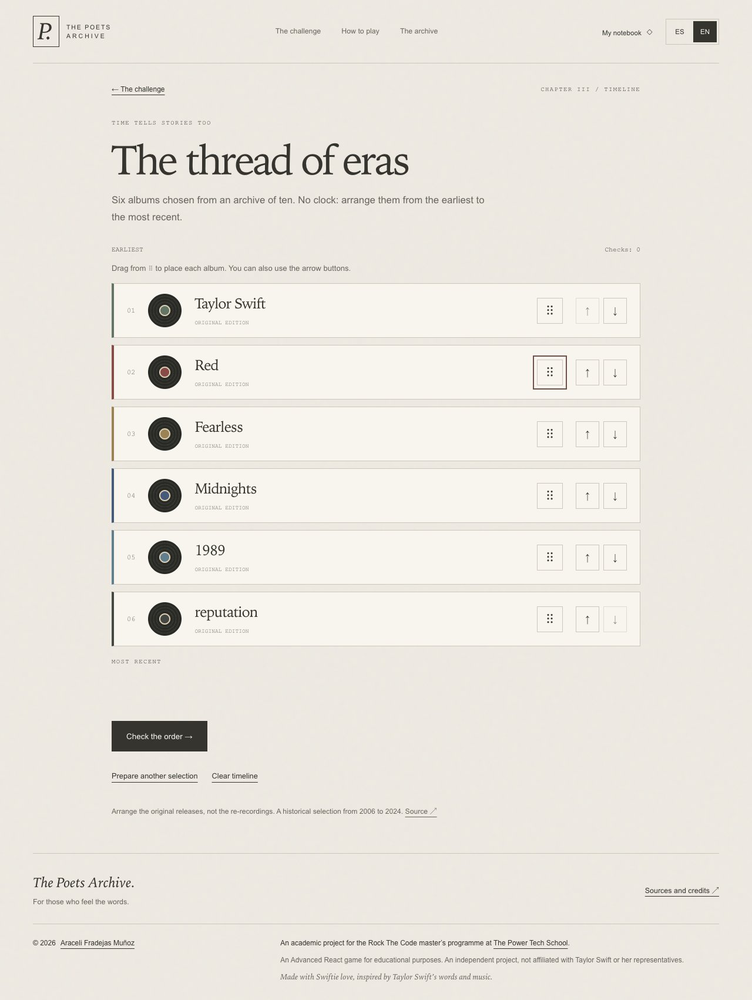

# The Poets Archive · The Tortured Poets Challenge

Un juego de música y literatura para reconocer voces, descubrir obras y ordenar las eras de Taylor Swift.

Proyecto de **React avanzado** como entrega del **MÓDULO 7: FRONTEND [REACT]** del máster **ROCK THE CODE** de [**The Power Tech School**](https://thepower.education/thepowermba/tech).

[](https://react.dev/)
[](https://reactrouter.com/)
[](https://vite.dev/)
[](https://developer.mozilla.org/en-US/docs/Web/JavaScript)
[](https://the-poets-archive.vercel.app)

> **Estado del proyecto:** aplicación publicada en Vercel, con tres desafíos, cuaderno de sesión e interfaz en castellano e inglés británico. El repositorio incluye pruebas de reglas, recorridos de navegador y capturas reales. El alcance de cada comprobación está documentado; la publicación no equivale a la aprobación del profesorado.

[Jugar en castellano](https://the-poets-archive.vercel.app) · [Play in English](https://the-poets-archive.vercel.app/en) · [Memoria técnica y evidencias](MEMORIA.md)

[Versión en castellano](#versión-en-castellano) · [English version](#english-version)


## Versión en castellano

## Descripción

**The Poets Archive** es la identidad del archivo y **The Tortured Poets Challenge** el nombre del juego. La idea parte de una pregunta: ¿sería capaz de distinguir una frase de Taylor Swift de una de Shakespeare sin conocer su procedencia?

Después de trabajar la discografía en el [Proyecto 6](https://github.com/AraceliFradejas/RTC-PROYECTO6-API-REST), he retomado esa temática desde una aplicación de React. Aquí las canciones se convierten en preguntas, las respuestas conducen a sus fuentes y las obras descubiertas forman un cuaderno personal durante la sesión.

La estética está inspirada en *The Tortured Poets Department*: papel, tinta, marfil, tonos oscuros y tipografía de lectura. Es un proyecto académico independiente, hecho con cariño swiftie.

## Objetivos académicos

- Organizar la aplicación en componentes con responsabilidades concretas.
- Utilizar `react-router-dom` y conservar el estado al navegar.
- Gestionar las transiciones de los juegos con `useReducer`.
- Crear y utilizar custom hooks para partida, cronología, cuenta atrás y foco.
- Controlar las actualizaciones del temporizador sin renderizar la pregunta cada segundo.
- Trabajar con HTML semántico, CSS organizado y diseño responsive.
- Mantener los datos solo en React, sin almacenamiento persistente.
- Documentar las fuentes, decisiones y comprobaciones con evidencias.

## Tres capítulos y un cuaderno

| Capítulo | Mecánica | Resultado |
| --- | --- | --- |
| **I · Entre dos plumas** | Distinguir entre Taylor Swift y Shakespeare en diez fragmentos. | Puntuación, aciertos, racha y repaso. |
| **II · La obra oculta** | Identificar la canción o la obra entre cuatro títulos de la misma procedencia. | Puntuación y revisión de las respuestas elegidas. |
| **III · El hilo de las eras** | Ordenar seis álbumes elegidos de un catálogo histórico de diez. | Años revelados al acertar y sello de Archivista. |
| **Mi cuaderno** | Consultar hallazgos, guardar favoritos y buscar por obra o autor. | Sellos y las últimas veinte partidas terminadas de la sesión. |

### Preguntas, pistas y puntuación

Los dos primeros capítulos comparten diez fragmentos: cinco canciones y cinco obras de teatro. Se puede jugar **sin prisa** o **a contrarreloj**, con veinte segundos por pregunta.

| Respuesta | Puntos |
| --- | ---: |
| Acierto sin pista | 100 |
| Acierto con pista | 50 |
| Error o tiempo agotado | 0 |

Cada ronda dispone de tres pistas, como máximo una por pregunta. Al responder se muestra la obra, su explicación, los créditos y los enlaces de referencia. Al terminar se puede iniciar otra partida, borrar el resultado o hacer una segunda lectura de los errores. El repaso es sin reloj y empieza con puntuación y pistas nuevas.

El contador permanece visible al desplazarse hasta las respuestas. Incluye segundos grandes, una barra proporcional y un aviso textual en los últimos cinco segundos. Al responder desaparece; en la siguiente pregunta vuelve a veinte segundos.

### Ordenar las eras

Las tarjetas se arrastran desde el tirador **⠿**, con ratón o pantalla táctil. También se pueden mover con los botones de subir y bajar. Con teclado, espacio coge y suelta la tarjeta, las flechas la desplazan y Escape cancela.

«Comprobar el orden» indica cuántos álbumes están en su posición. Se pueden hacer varios intentos. Al completar la cronología se muestran los años originales; las fechas de las regrabaciones no se mezclan con esos lanzamientos.

### Qué se conserva y cuándo se borra

| Acción | Comportamiento |
| --- | --- |
| Visitar instrucciones, archivo o cuaderno | La partida y sus puntos se conservan. |
| Volver al inicio | Se puede retomar mediante «Volver a ella» o «Retomar mi cronología». |
| Cambiar ES/EN | Se conservan pregunta, puntos, pistas, plazo y orden de las eras. |
| Salir de la pantalla durante el contrarreloj | El plazo sigue transcurriendo; al volver se comprueba si ha vencido. |
| Abandonar la partida o comenzar otra | Se reinicia o sustituye la partida de preguntas actual. |
| Recargar o cerrar la página | Se pierden partidas, favoritos y cuaderno. |

No se utilizan `localStorage`, `sessionStorage`, cookies de partidas, caché persistente ni bases de datos. Es una decisión vinculada al requisito de esta entrega: mantener los datos con React. Los resultados terminados se registran en el cuaderno mientras dure la sesión.

## Idiomas y rutas

La interfaz está disponible en **castellano** e **inglés británico (`en-GB`)**. Los fragmentos y títulos conservan su idioma original; cambiar de idioma no traduce las citas de Shakespeare ni los títulos de canciones.

| Castellano | Inglés | Contenido |
| --- | --- | --- |
| `/` | `/en` | Portada, selección de capítulo y modo. |
| `/instrucciones` | `/en/how-to-play` | Reglas y uso del juego. |
| `/archivo` | `/en/archive` | Obras, fuentes y créditos. |
| `/partida` | `/en/game` | Preguntas y revelaciones. |
| `/resultados` | `/en/results` | Puntuación y repaso. |
| `/cuaderno` | `/en/notebook` | Hallazgos, favoritos, sellos e historial. |
| `/cronologia` | `/en/timeline` | Ordenación de las eras. |
| Ruta desconocida | Ruta desconocida | Página no encontrada. |

## Tecnologías

| Herramienta | Uso en el proyecto |
| --- | --- |
| React 19 | Componentes, contextos, estados, efectos y reducers. |
| React Router 7 | Navegación y rutas equivalentes ES/EN. |
| JavaScript y CSS | Reglas, catálogos, estilos y adaptación responsive. |
| Vite 7 | Desarrollo, compilación y generación de HTML. |
| dnd-kit | Arrastre de las eras, sensores y controles accesibles. |
| Vitest | Pruebas de reglas, datos y traducciones. |
| Playwright y axe-core | Recorridos de navegador y comprobación automática de accesibilidad. |
| Vercel | Publicación de la web desde GitHub. |

Se ha consultado React Hook Form, pero no se utiliza: el formulario de entrada elige capítulo y modo mediante radios nativos. `useState` cubre esa necesidad. Las versiones exactas de las dependencias están en `package-lock.json`.

## Arquitectura

```text
src/
  components/   Interfaz compartida, portada, cuaderno, cronología y reloj
  context/      Partida, cronología, cuaderno e idioma
  data/         Preguntas, créditos, fuentes y álbumes
  game/         Reducers, reglas, mezcla y duración de preguntas
  hooks/        useGame, useChronology, useCountdown y useFocus
  i18n/         Traducciones al inglés y correspondencia de rutas
  pages/        Las siete pantallas de la aplicación
  seo/          Metadatos y renderizado a HTML
  styles/       Hojas de estilos por responsabilidad
public/         Imagen de portada, favicon y llms.txt
scripts/        Prerenderizado y medición de renderizados
tests/          Reglas y recorridos de navegador
docs/           Validaciones, fuentes, despliegue y capturas
```

Los proveedores de estado están por encima de las rutas. Los reducers reciben acciones y calculan el siguiente estado; las pantallas presentan el resultado. El temporizador mantiene sus segundos dentro de `Timer`. La [memoria](MEMORIA.md#5-arquitectura) explica los estados, hooks y componentes con sus archivos de referencia.

## Instalación y configuración

Requisito: **Node.js 22.12 o posterior**, compatible con las dependencias del proyecto.

```bash
git clone https://github.com/AraceliFradejas/RTC-PROYECTO12-REACT-AVANZADO.git
cd RTC-PROYECTO12-REACT-AVANZADO
npm ci
npm run dev
```

Abrir `http://127.0.0.1:5173`. No hacen falta cuentas, credenciales ni conexión con una API para jugar.

La variable pública `SITE_URL` se utiliza durante la compilación para generar canónicas y sitemap. No contiene secretos. Para reproducir la compilación del dominio publicado:

```bash
SITE_URL=https://the-poets-archive.vercel.app npm run build
npm run preview
```

La configuración de Vercel y el tratamiento de las rutas se explican en [Despliegue](docs/DESPLIEGUE.md).

## Pruebas y evidencias

```bash
npm run lint
npm test
npm run build
npm run test:e2e
npm run check:renders
```

Playwright inicia la vista previa de la compilación local. Utiliza Chrome si está instalado en su ubicación habitual de macOS; en otro entorno hay que instalar Chromium con `npx playwright install chromium`.

Para ejecutar los recorridos contra la web publicada:

```bash
PLAYWRIGHT_BASE_URL=https://the-poets-archive.vercel.app npm run test:e2e
```

Se han comprobado 18 pruebas unitarias y recorridos de partida, idiomas, cuaderno, cronología, arrastre, visibilidad del reloj y conservación de puntuación. Las ejecuciones se han realizado por bloques; no se presenta su suma como una única ejecución final. [Resultados y alcance](docs/VALIDACION.md).

La medición del temporizador muestra tres cambios de segundo sin nuevos renderizados de `Game` ni `QuestionCard`. Las pruebas móviles utilizan Chromium con un perfil de iPhone 13: pantalla de 390 × 844 y área útil de 390 × 664 píxeles CSS. Esto no equivale a una prueba en un iPhone físico. Safari de macOS se revisó con un recorrido manual limitado, anterior a las últimas mejoras de arrastre y contador.

### Evidencias destacadas

| Selección compacta en móvil | Contrarreloj visible en móvil |
| :---: | :---: |
|  |  |



La [galería comentada de la memoria](MEMORIA.md#12-evidencias) diferencia lo que muestra cada imagen de lo que comprueba una prueba funcional.

## Fuentes, enlaces y recursos visuales

Las canciones enlazan con su vídeo oficial y con pistas de Apple Music y Spotify. Las obras de Shakespeare enlazan con el pasaje de **Folger Shakespeare Library**. Las fuentes, créditos y explicaciones forman parte del catálogo y aparecen en el archivo y después de responder. La disponibilidad de las plataformas puede cambiar según el país o requerir una cuenta.

JetPunk y TriviaCreator se citan como referencias del formato, no como fuentes de atribución de las preguntas. [Revisión de enlaces](docs/ENLACES.md).

La portada utiliza una escena editorial generada con IA y optimizada a JPEG de unos 288 KB. No es una fotografía real ni una imagen oficial de Taylor Swift. El cuaderno, los discos y los sellos se construyen con CSS; el favicon es SVG. Las tipografías son del sistema. [Procedencia del recurso y prompt](docs/RECURSOS.md).

## Accesibilidad, SEO y acceso para asistentes

La interfaz utiliza controles nativos, foco visible, un enlace para saltar al contenido y movimiento reducido. Hay alternativa sin reloj, botones para ordenar sin arrastrar y avisos que no dependen solo del color. La auditoría automática con axe-core no sustituye una revisión con lector de pantalla.

La compilación genera dieciséis documentos HTML. Portada, instrucciones y archivo son legibles sin JavaScript en ambos idiomas. Se incluyen metadatos por ruta, Open Graph, Twitter Card, `WebApplication`, `robots.txt`, canónicas, alternativas `hreflang` y seis URL públicas en el sitemap. Partida, resultados, cuaderno, cronología y 404 llevan `noindex`.

`llms.txt` describe la web y enlaza su contenido. Estas medidas facilitan su lectura por buscadores y asistentes; no garantizan posiciones, indexación ni menciones. Vercel devuelve 404 en rutas inexistentes; bajo `/en/`, el documento inicial de error es español y React lo adapta al inglés al cargar. Las páginas inglesas existentes sí reciben HTML en inglés.

## Documentación

- [Memoria técnica y evidencias](MEMORIA.md).
- [Correspondencia con los requisitos](docs/REVISION-ENTREGA.md).
- [Pruebas, accesibilidad y renderizados](docs/VALIDACION.md).
- [Despliegue en Vercel](docs/DESPLIEGUE.md).
- [Fuentes y enlaces](docs/ENLACES.md).
- [Recursos visuales](docs/RECURSOS.md).

## Aviso académico y de propiedad intelectual

He desarrollado este proyecto como ejercicio académico dentro de mi formación en React avanzado. Soy **Araceli Fradejas Muñoz** y he creado este archivo desde el cariño, el respeto y mi admiración como swiftie por Taylor Swift.

Es un proyecto independiente, educativo y no oficial. No existe afiliación, autorización ni patrocinio de Taylor Swift, Taylor Nation ni sus representantes. Los nombres, canciones, álbumes y obras citadas pertenecen a sus respectivos titulares.

El proyecto no tiene finalidad comercial. Se muestran fragmentos breves con atribución y enlaces a las fuentes; no se incorporan grabaciones ni letras completas. La imagen de portada es una recreación generada para el proyecto, identificada como tal. El footer recoge la autoría, el máster Rock The Code, el enlace a la escuela y el aviso en el idioma seleccionado.

## Autora

**Araceli Fradejas Muñoz**

Proyecto académico del máster Rock The Code · The Power Tech School.

### Redes sociales y enlaces

- [GitHub](https://github.com/AraceliFradejas)
- [LinkedIn](https://www.linkedin.com/in/araceli-fradejas-munoz-transformaciondigital/)
- [Instagram](https://www.instagram.com/goldilocks1013x/)
- [X](https://x.com/AraceliFradejas)
- [TikTok](https://www.tiktok.com/@arucci1)
- [YouTube](https://www.youtube.com/@aracelifradejasmunoz2758)
- [Medium](https://medium.com/@araceli.fradejas)

---

## English version

### Description

**The Poets Archive · The Tortured Poets Challenge** is an educational project for **MODULE 7: FRONTEND [REACT]**, part of the **ROCK THE CODE** master’s programme at **The Power Tech School**, created by **Araceli Fradejas Muñoz**.

It brings together Taylor Swift’s music and Shakespeare’s writing through three challenges. The visual style takes inspiration from the paper, ink and intimate atmosphere of *The Tortured Poets Department*. It continues the musical theme explored in [Project 6](https://github.com/AraceliFradejas/RTC-PROYECTO6-API-REST).

> **Project status:** published on [Vercel](https://the-poets-archive.vercel.app/en), with working Spanish and British English interfaces. Test evidence and its limitations are documented in the repository. Publication does not imply academic approval.

### Academic goals and technologies

The project practises reusable components, React Router, custom hooks, reducers, responsive CSS and controlled re-rendering. It uses React 19, React Router 7, Vite 7, JavaScript, CSS and dnd-kit. Vitest checks rules and data; Playwright and axe-core check browser journeys and accessibility. Exact versions are recorded in `package-lock.json`.

The chapter and mode selectors use native radio inputs and React state. React Hook Form was considered but is not needed for this form.

### Chapters and rules

| Chapter | How it works |
| --- | --- |
| **Between two pens** | Identify Taylor Swift or Shakespeare in ten excerpts. |
| **The hidden work** | Choose the song or play from four titles. |
| **The thread of eras** | Arrange six albums selected from a historical catalogue of ten. |
| **My notebook** | Discoveries, favourites, search, reading stamps and the last twenty completed games. |

The first two chapters offer unhurried play or twenty seconds per question. Each round has three hints. A correct answer earns 100 points, or 50 with a hint; a wrong answer or timeout earns zero. Results include a review of mistakes, played without a clock and with a fresh score.

The timer stays visible whilst scrolling towards the answers. It shows large seconds, a shrinking bar and a warning for the last five seconds. It disappears after answering and starts again for the next question.

Drag timeline cards using **⠿**, or use the up and down buttons. Keyboard users can pick up and drop with Space, move with the arrow keys and cancel with Escape. Checking the timeline reveals how many albums are correctly placed; years appear once the whole order is correct.

### Languages and session data

Spanish starts at `/`; British English starts at `/en`. The English routes are `/en/how-to-play`, `/en/archive`, `/en/game`, `/en/results`, `/en/notebook` and `/en/timeline`.

Changing language or visiting other pages within the app preserves the game, score, hints, deadline and timeline order. The clock continues to run whilst away from the question. Leaving a game through its explicit action or starting a new one clears or replaces that game.

Refreshing or closing the page clears all session data. There are no accounts, databases, game cookies, `localStorage`, `sessionStorage` or persistent caches. This follows the assignment’s requirement to keep data in React. The notebook records completed games only for the current session. Excerpts and work titles remain in their original language.

### Running and checking the project

Use Node.js 22.12 or later:

```bash
git clone https://github.com/AraceliFradejas/RTC-PROYECTO12-REACT-AVANZADO.git
cd RTC-PROYECTO12-REACT-AVANZADO
npm ci
npm run dev
```

No credentials or external API are required to play. Set `SITE_URL=https://the-poets-archive.vercel.app` when building to generate canonical URLs and the sitemap. Run `npm run build` before `npm run preview` or the local browser tests.

Available checks are `npm run lint`, `npm test`, `npm run test:e2e` and `npm run check:renders`. Install Chromium with `npx playwright install chromium` if Chrome is not available at the configured macOS location. Set `PLAYWRIGHT_BASE_URL` to test a deployment instead of the local preview.

The evidence covers 18 unit tests and browser journeys executed in documented batches. Mobile tests use Chromium with an iPhone 13 profile, not a physical iPhone. A limited manual Safari check predates the latest drag and timer changes. The timer measurement confirmed no additional Game or QuestionCard renders during three seconds of countdown.

### Sources, accessibility and deployment

Songs link to official videos and individual Apple Music and Spotify tracks. Shakespeare excerpts link to Folger Shakespeare Library passages. Platform availability may vary by region. JetPunk and TriviaCreator are references for the game format.

The cover scene is an AI-generated illustration, not a real location or an official photograph. Its provenance is documented in [Resources](docs/RECURSOS.md). Discs, stamps and the notebook are CSS illustrations.

The interface supports keyboard controls, visible focus, reduced motion and an untimed mode. Automated accessibility checks do not replace an audit with assistive technology. Public editorial pages are prerendered in both languages, with metadata, canonical URLs, language alternatives and a sitemap. Session pages use `noindex`. `llms.txt` is informational and does not guarantee search rankings or inclusion in assistant responses. Unknown English routes initially receive a Spanish 404 document; React then switches the error page to English.

See the [technical report](MEMORIA.md), [validation record](docs/VALIDACION.md), [deployment guide](docs/DESPLIEGUE.md) and [source review](docs/ENLACES.md) in Spanish.

### Academic and intellectual property notice

This is an independent, unofficial educational project made with Swiftie love. It is not affiliated with, authorised or sponsored by Taylor Swift, Taylor Nation or their representatives. Referenced works belong to their respective rights holders. The project has no commercial purpose and includes brief attributed excerpts, without recordings or complete lyrics.

**Araceli Fradejas Muñoz** · Rock The Code · The Power Tech School. Contact and social links are listed in the [author section](#autora).
